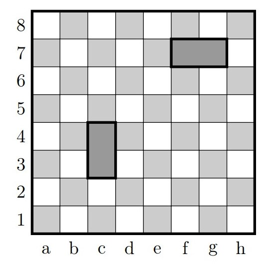
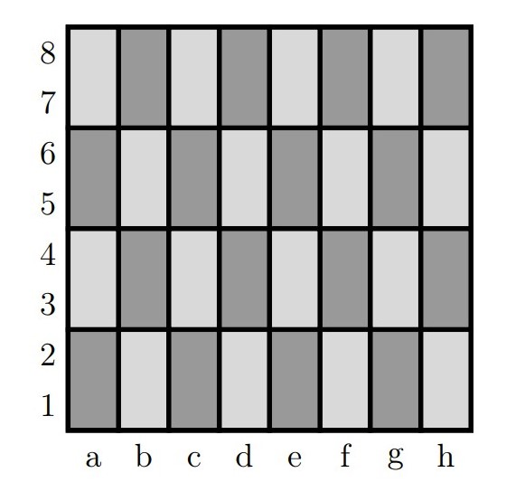
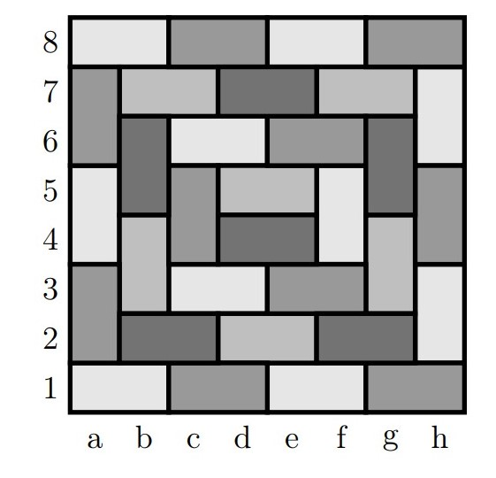

# Problemas del tablero de ajedrez

## 1.1 Problemas del tablero de ajedrez
Suponga que tiene un tablero de ajedrez (cuadrícula de 8x8 cuadrados) y un montón de fichas de dominó (cada ficha de 2x1 cuadrados), de modo que cda ficha de dominó puede cubrir perfectamente dos cuadrados del tablero de ajedrez [^nota1]. 



Tenga en cuenta que con 32 fichas de dominó puede cubrir las 64 casillas del tablero de ajedrez. Hay muchas 
maneras diferentes de colocar las fichas de dominó para hacer esto, pero una forma es cubrir la primera columna con 4 fichas de dominó de un extremo a otro, cubrir la segunda columna con 4 fichas de dominó y así sucesivamente.



Por supuesto, esa no es la única manera. Aquí hay una forma ingeniosa de cubrir todos los cuadrados:



Las matemáticas se basan en definiciones, así que démosle un nombre a esta idea de cubrir todos 
los cuadrados. Además, no lo definamos solo para tableros de 8 × 8 ; permitamos que la definición se 
aplique a tableros de otras dimensiones.


`````{admonition} Definición 1.1
:class: tip
:name: def_1.1
Definición 1.1 Se denomina "cubierta perfecta del tablero" a cubrir el tablero de ajedrez de m × n con fichas de dominó de 2 × 1 sin que existan casillas descubiertas, y sin fichas de dominó apiladas o colgando fuera del tablero de ajedrez.
`````

Como demostramos anteriormente, existen cubiertas perfectas del tablero de ajedrez de 8 × 8. Este es un libro sobre demostraciones, así que escribamos esto como una **proposición** (algo que es verdadero y requiere demostración) y luego escribamos una demostración formal de este hecho.


`````{admonition} Proposición 1.2
:class: tip
:name: prop_1.2
Proposición 1.2. Existe una cubierta perfecta de un tablero de ajedrez de 8 × 8.
`````
Antes de hacer otras demostraciones, discutiremos de algunos de los ingredientes clave de las demostraciones. 


[^nota1]:  A lo largo de los bordes izquierdo e inferior del tablero de ajedrez hay números y letras. Estos son 
simplemente para etiquetar las filas y las columnas del tablero de ajedrez.