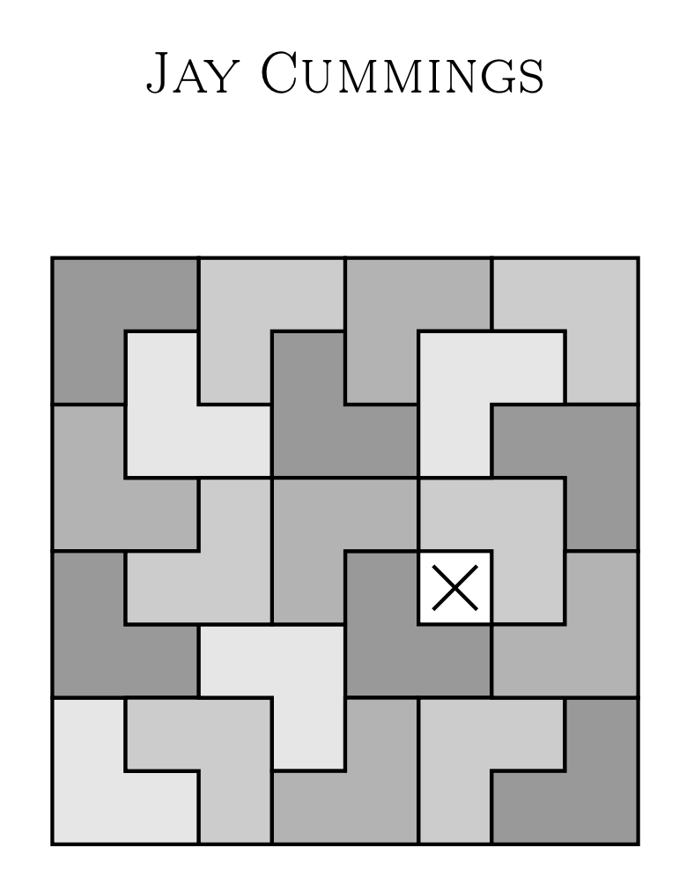

# Bienvenido al libro de Pruebas

 

Este libro de texto está diseñado para estudiantes. En lugar del estilo típico de definición-teorema-demostración-repetición, este texto incluye comentarios, motivación y explicación. Las demostraciones no son concisas y buscan fomentar la comprensión en lugar de la economía. Además, docenas de demostraciones van precedidas de "trabajo previo" o un esquema de la demostración para brindar a los estudiantes una visión general y una explicación de cómo podrían llegar a ella por sí mismos.

Este libro cubre demostraciones intuitivas, demostraciones directas, conjuntos, inducción, lógica, la contrapositiva, contradicción, funciones y relaciones. El texto tiene como objetivo hacer visibles las ideas y contiene más de 200 ilustraciones. La redacción es relajada y conversacional e incluye intentos periódicos de humor.

Este texto también es una introducción a las matemáticas superiores. Esto se logra en parte a través de los ejemplos y teoremas seleccionados. Además, al final de cada capítulo hay una introducción a un área de las matemáticas. Estas incluyen la teoría de Ramsey, teoría de números, topología, secuencias, análisis real, grandes datos, teoría de juegos, cardinalidad y teoría de grupos.

Después de cada capítulo hay "consejos profesionales", que son reflexiones breves sobre cosas que me hubiera gustado saber cuando tomé mi clase de introducción a las demostraciones. Incluyen comentarios más detallados sobre el material, consejos de estudio, notas históricas, comentarios sobre la cultura matemática y más. Además, después de los ejercicios de cada capítulo hay una introducción a un problema no resuelto en matemáticas.

En el primer apéndice discutimos algunos métodos de demostración adicionales, el segundo apéndice es una colección de demostraciones especialmente hermosas y el tercero es un consejo sobre escritura.

Revisa el contenido del libro.

```{tableofcontents}
```
